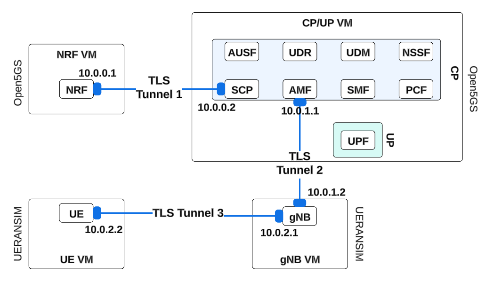

## Acknowledgments ##

This version of 5G testbed demo was possible by merging open-source projects: 

- [Open5Gs](https://github.com/open5gs/open5gs "Open5Gs")

- [UERANSIM](https://github.com/aligungr/UERANSIM "UERANSIM")

- [VPN Over TLS ](https://github.com/dmitriykuptsov/vpn_over_tls "vpn_over_tls")

# 5G PQ TLS Tunnel

## Project Description ##
This project involves deploying a 5G network simulation using Open5GS and UERANSIM and establishing a secure communication tunnel using post-quantum (PQ) certificates with TLS as shown in the figure below. 

## Getting started ##
This project consists of several steps based on building several projects to deploy a secure communication within a 5G testbed. All the instructions are going to be found in [Deployment and Setup](Setup/README.md)

To avoid compatibility issues, we provide the zip files with the version of Open5GS, UERANSIM, and VPN over TLS and they can be found in this repo. We recommend using this instead than the latest branch of the mentioned open source project. 

* [UERANSIM.zip](./UERANSIM.zip)
* [Open5GS.zip](./open5gs.zip)
* [VPN_over_TLS.zip](./vpn_over_tls-master-final.zip)